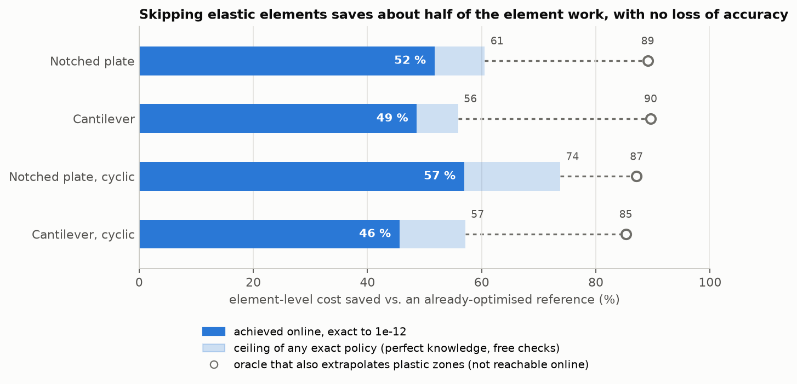
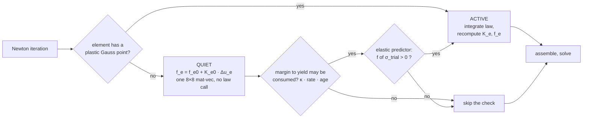
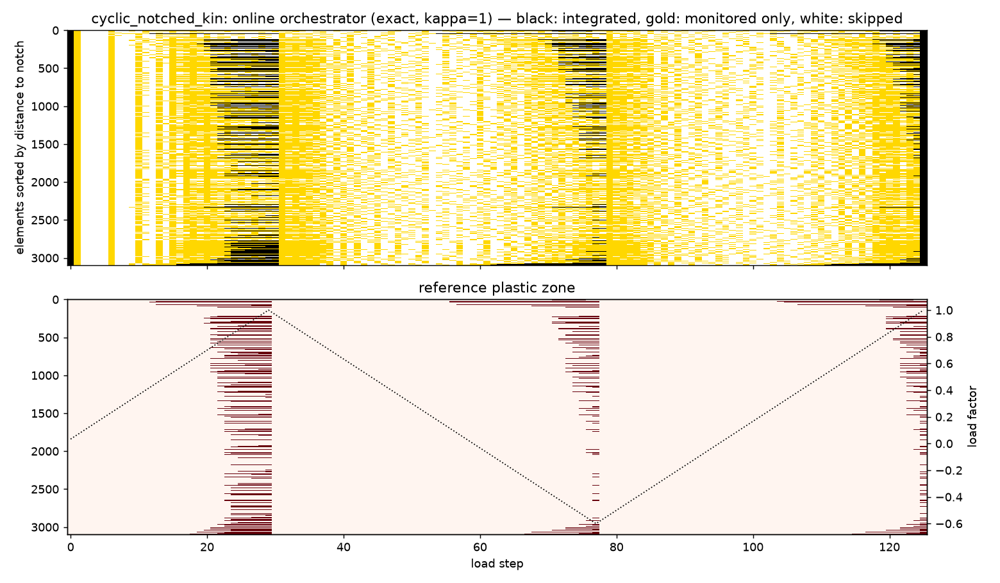
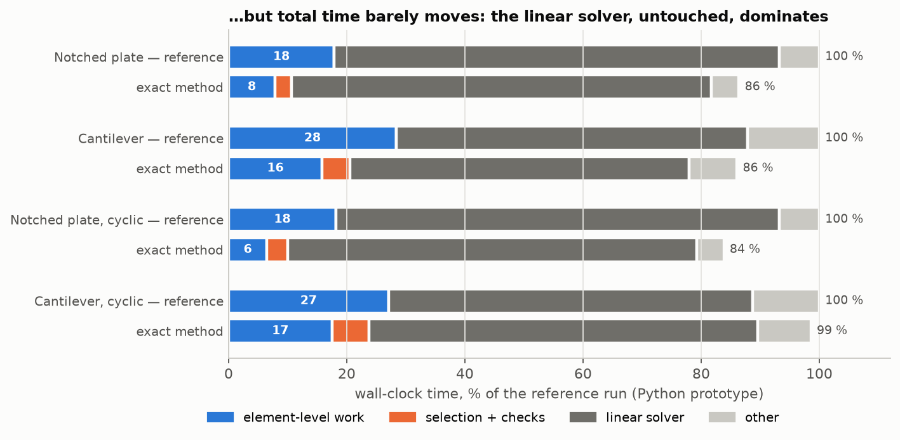
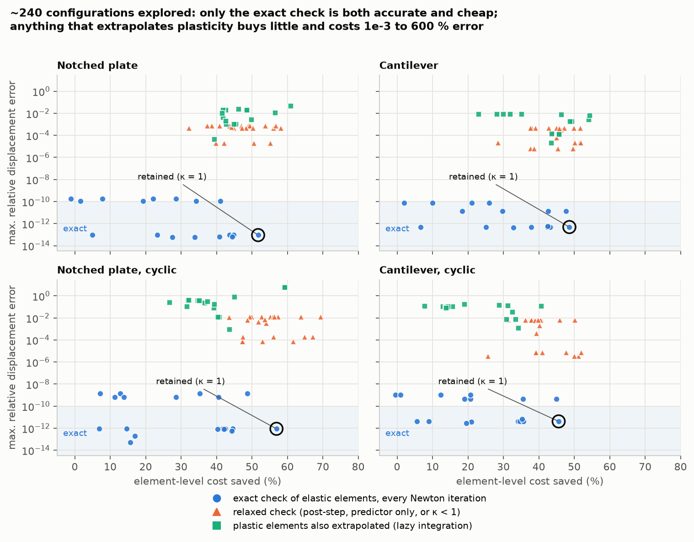
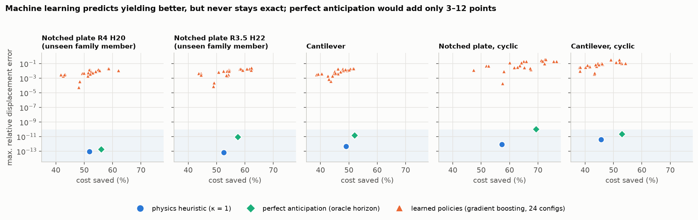

# adaptfem — can a nonlinear FE solver skip the elements where nothing happens?

A research exploration of **adaptive allocation of computational effort** in implicit,
incremental elastoplastic finite element analysis — and of whether **machine learning**
helps decide where to spend that effort.

The question: at every Newton iteration, a standard FE code re-integrates the constitutive
law and re-assembles *every* element, although plasticity lives in a small, moving part of
the domain. Can we concentrate the work where the physics is active, **on a fixed mesh and
without degrading the solution**? And does a learned policy do better than a well-designed
physical criterion?

## TL;DR

| | Result |
|---|---|
| ✅ **The idea works, exactly** | Skipping *elastic* elements (replacing them by a cached linearisation, guarded by the elastic predictor) saves **~46–57 % of the element-level work** against an already-optimised reference, with the **same solution to 1e-12** and the **same Newton iterations**. |
| ⚠️ **But total time barely moves here** | In this 2D Python prototype the linear solver dominates, so wall-clock gains are **1–16 %**. The gain matters when the constitutive law is expensive (crystal plasticity, damage, heavy UMATs). |
| ❌ **Extrapolating plastic zones fails** | An a-posteriori oracle promised 85–90 %. Online, extrapolating plastic elements gives errors from 1e-3 to 600 % and costs extra Newton iterations. Plasticity is path-dependent; it must be integrated. |
| ❌ **Machine learning does not help here** | A gradient-boosting policy predicts yielding 2–4× more accurately than the heuristic, but **never stays exact**. Perfect anticipation would only add 3–12 points: the decision is a *safety* decision, and physics already makes it safely. |



## The idea in one picture

Elastic elements respond **exactly linearly** (small strains). So between two load steps,
an elastic element's contribution is *exactly* its cached linearisation — no constitutive
call, no Gauss-point loop. The only thing to watch is whether it is about to yield, and
the elastic predictor (the first half of every radial-return algorithm) answers that
exactly and cheaply.



Three rules, one parameter (κ = 1):

1. **Plastic elements always stay active.** Extrapolating them is where all the tempting
   (and failing) ideas lived.
2. **Elastic elements are quiet**: their force is `f_e0 + K_e0 · (u_e − u_e0)`, which is
   exact as long as they stay elastic.
3. **They are checked with the elastic predictor inside every Newton iteration**, so a
   waking element is absorbed by the current Newton loop at no extra iteration — but only
   when its last margin to yield could have been consumed at the fastest stress rate seen
   on the mesh (`margin ≤ κ · rate · (age + 1)`). Checking is the dominant cost of the
   method (half the cost of an active element), so *not* checking is where the savings come
   from.

The integrated set then follows the plastic zone, element by element, including through
unloading and reloading (cyclic case: black = integrated, gold = checked only, white =
skipped entirely):



## Results

### Element work halves… but the linear solver does not care



The method removes roughly half of the element-level time, but in this prototype
element-level work is only 18–28 % of the run (27–43 % with a naive reference): the LU
factorisation, untouched, dominates. **Wall-clock gain ≈ element-level gain × element share
of the time.** This is the single most important number to measure before porting the idea
to another code.

### Everything that was explored

About 240 configurations were run on four cases (notched plate, cantilever, and cyclic
versions with kinematic hardening): *when* to check (every iteration, predictor only,
after convergence, after the step), *how much* to check (κ), lazy integration of plastic
elements with drift tolerances, periodic catch-up steps, waking neighbours, safety
margins, global wake-up on load reversal, modified Newton.



Only one family lands in the "exact" band while saving a lot: the exact in-iteration check.
Everything that extrapolates plasticity (green) or relaxes the elastic check (orange)
trades a few points of savings for errors of 1e-5 up to 600 %.

### Machine learning vs physics

The only loss-free decision left is *which* elastic elements to check *when*. A
gradient-boosting model was trained, with no external dataset (labels come from the
reference simulations: "the solver is its own teacher"), to predict how many steps remain
before an element yields.



It predicts better (MAE ÷ 2 to 4), yet every one of its 24 configurations misses yield
events on every case. The oracle (perfect anticipation) shows the ceiling: only 3–12
points above the physics heuristic. The heuristic re-checks as soon as the margin *could*
have been consumed — a physical guarantee; a regressor offers a statistical one, and its
6–38 % over-optimistic predictions fall exactly on the elements that matter.

## What transfers to other FE computations, and what does not

| Finding | Generic? | Why / conditions |
|---|---|---|
| Cache the linearisation of elements whose response is currently linear, guard it with an exact cheap test | ✅ Generic principle | Needs a constitutive law **with an elastic domain** (plasticity, threshold damage, threshold viscoplasticity). Not applicable to laws that are nonlinear everywhere (hyperelasticity, viscoelasticity). |
| Small strains | ⚠️ Hidden condition | With geometric nonlinearity an "elastic" element is no longer linear: the cache stops being exact. Everything here is small-strain. |
| The check is the main cost: bound it (margin vs. observed rate) | ✅ Generic | Checking everything cancels the gain (5–7 % left). Any implementation must skip provably safe checks. |
| Check inside the Newton iteration, not after convergence | ✅ Generic | After convergence, every wake-up forces a re-convergence (+40 to +80 % iterations). Requires a hook inside the Newton loop of the host code. |
| Never extrapolate path-dependent (plastic) elements | ✅ Generic | True for any law with memory; errors reach 600 % on load reversal. |
| Measure the element share of wall time first | ✅ Generic | It caps the achievable wall-clock gain in any code. |
| "46–57 %", κ = 1 | ❌ Case-specific | Small, localised plastic zones (4–12 % of elements, notches), a cheap J2 law (plastic/elastic cost ratio ≈ 3), 2D, Python cost models. Re-measuring unit costs on another machine moved these by −5 to +9 points. |
| "1–16 % wall-clock" | ❌ Prototype-specific | Higher for expensive laws, lower for large 3D models dominated by the linear solver. |
| "Learning does not help" | ⚠️ Mostly generic reasoning, narrow evidence | The argument (exactness makes the decision a safety problem) is general; the evidence is one family of notched plates. |

## Is this new?

Partitioning a domain into plastic and quasi-elastic regions on a fixed mesh is **not new**
(Radermacher & Reese 2014; Kerfriden et al. 2013; global/local methods; hyper-reduction),
and re-assembling only plastic blocks is standard practice (Čermák, Sysala & Valdman 2019 —
the reference used for every comparison here). What this project adds: an **oracle
measurement of the upper bound** of the gain, a variant that is **exact with no reduced
basis or surrogate**, a measured explanation of **why the oracle bound does not transfer**,
and a head-to-head **heuristic vs. learning vs. oracle** comparison. See
[`docs/literature.md`](docs/literature.md) (full texts of the two closest papers were not
available and remain to be read).

## Repository layout

| path | content |
|---|---|
| `adaptfem/material.py` | plane-strain J2 plasticity, isotropic (linear + Voce) and kinematic hardening, radial return, consistent tangent (vectorised + scalar reference) |
| `adaptfem/element.py` | Q4, 2×2 Gauss, B-bar, pattern-based assembly |
| `adaptfem/mesh.py`, `cases.py` | structured meshes, notched plate; test cases (monotonic, overloaded, cyclic, shear block) |
| `adaptfem/solver.py` | incremental Newton-Raphson with tangent predictor, cost counters and timers, quiet-element path |
| `adaptfem/orchestrator.py` | **the retained method** (~80 lines): exact selective integration with the κ-bounded elastic-predictor check |
| `adaptfem/oracle.py`, `benchmark.py`, `metrics.py` | a-posteriori oracle study, unit-cost micro-benchmarks, error metrics |
| `experiments/` | Phase 0 oracle scripts, κ sweep, space-time maps, bound recomputation, README figures |
| `results/` | raw outputs of every campaign (see [`results/README.md`](results/README.md)) |
| `docs/` | write-ups (below) and figures |

The abandoned variants (lazy plastic integration, catch-up, neighbour propagation,
post-step checks, modified Newton) and the machine-learning policies are preserved at git
tag **`exploration-complete`** (commit `b062a19`).

## Reproduce

```bash
pip install -r requirements.txt
python -m pytest -q                              # 9 tests, incl. "exact orchestrator = reference"

python experiments/phase0_oracle.py              # oracle potential on 5 cases (~3 min)
python experiments/phase0_stepsize.py            # load-step sensitivity of the potential
python experiments/phase0_baselines.py           # vs. the Sysala baseline
python experiments/phase2_kappa_sweep.py         # exact method, κ ∈ {0, 0.5, 1, 2}, 4 cases (~10 min)
python experiments/phase2_maps.py                # space-time maps
python experiments/oracle_vs_online.py           # ceilings vs. achieved
python experiments/make_figures.py               # README figures, from stored results only
```

Operation counters are deterministic; unit costs are micro-benchmarked on your machine,
so savings percentages move by a few points between machines (the ranking does not).

## Documents

| document | content |
|---|---|
| [`docs/verdict.md`](docs/verdict.md) | one-page summary: is it a good idea, how much, limits, what AI adds, next steps |
| [`docs/experiments.md`](docs/experiments.md) | the full experiment log, negative results included |
| [`docs/article.md`](docs/article.md) | paper-style write-up (working draft) |
| [`docs/industrial_integration.md`](docs/industrial_integration.md) | what it would take to graft this onto an existing industrial FE code |
| [`docs/literature.md`](docs/literature.md) | literature review and positioning |

## What would come next

1. An **expensive constitutive law** (crystal plasticity, damage) and **3D**, where element
   work dominates the run time — the regime where this method pays off.
2. The **solver phase**: a low-rank update of the factorisation on the active blocks (a
   plain modified Newton diverged).
3. If learning at all: a policy that may only **delay** a check within the κ bound, never
   beyond — safe by construction, targeting the cyclic cases where 3–12 points remain.

## License

MIT.
